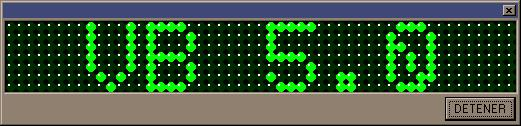

<div align="center">

## LEDS MESSENGER DISPLAY


</div>

### Description

Este codigo muestra algunas funciones de logica y una red de lazos, ademas se ve bien

(This code show some logic functions and loops net, Is GOOD [If my english is bad, Sorry !!!])
 
### More Info
 


<span>             |<span>
---                |---
**Submitted On**   |2002-01-11 10:44:24
**By**             |[MIGUEL ANGEL BOCANEGRA ALCOCER](https://github.com/Planet-Source-Code/PSCIndex/blob/master/ByAuthor/miguel-angel-bocanegra-alcocer.md)
**Level**          |Intermediate
**User Rating**    |4.3 (17 globes from 4 users)
**Compatibility**  |VB 5\.0, VB 6\.0
**Category**       |[Graphics](https://github.com/Planet-Source-Code/PSCIndex/blob/master/ByCategory/graphics__1-46.md)
**World**          |[Visual Basic](https://github.com/Planet-Source-Code/PSCIndex/blob/master/ByWorld/visual-basic.md)
**Archive File**   |[LEDS\_MESSE479711112002\.zip](https://github.com/Planet-Source-Code/miguel-angel-bocanegra-alcocer-leds-messenger-display__1-30695/archive/master.zip)

### API Declarations

```
'NINGUNA
```


